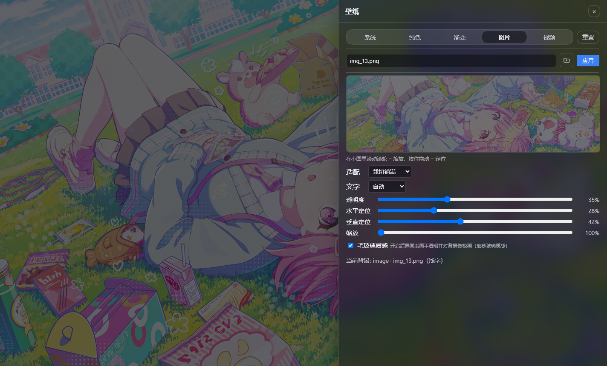

# dsh-bg-new



DSH（DeepSeek Harness）网页界面换背景插件：点左侧栏（Settings 上方）的**「壁纸」按钮**，右侧弹出抽屉，可换**系统预设 / 纯色 / 渐变 / 图片 / 视频**五种背景，滚轮 + 拖动的小图同时管缩放与定位，可选毛玻璃质感。桌面端**即时生效**、无需刷新，重启后仍在。

也可以直接对模型说「把背景换成深蓝」「用这张图做壁纸」，由 `bg_apply` 工具完成。

> 非官方社区插件，MIT。逐版变更见 [CHANGELOG.md](./CHANGELOG.md)。

## 功能

- 🎨 **五种背景**：系统预设 / 纯色 / 渐变 / 图片 / 视频（本地文件或远程链接）
- 🗂️ **侧栏入口 + 右侧抽屉**：不用进设置页；抽屉打开时自动收起左侧栏与聊天区并降透明，专注调参，点抽屉外即关闭
- 🖱️ **小图同时管缩放与定位**：滚轮缩放、拖动定位；指针拖到小图外有 2 秒宽限，超时才释放
- 📐 **适配与焦点**：fill / cover / contain 等 5 种适配，水平与垂直焦点可调，另有自由缩放与放大聚焦
- 🪟 **毛玻璃质感**：可选让面板、气泡、输入框变成半透明磨砂表面
- 🎞️ **动态壁纸**：本地 MP4 循环播放，可静音、可调音量；**视频不设体积上限**
- 🤖 **模型也能换**：`bg_apply` 工具支持颜色 / 渐变 / 图片 / 视频 / 本地文件 / 关闭
- 🌗 **文字方案**：按背景亮度自动推断，也可手动指定亮 / 暗文字方案
- 🔒 **媒体只在本机**：上传的图片与视频保存在本机数据目录，由插件自己的路由伺服（支持 Range，视频可拖动进度），**不会上传到任何云端服务**

## 安装

前置：已装好 DSH（`dsh web` 能正常运行）。

### 方式一：git 通道（推荐）

```sh
dsh plugin --profile web add github:sz1698/dsh-bg-new
```

装完**重启应用**（或重启 `dsh web`），再刷新浏览器。

`dsh` 不在 PATH 时：

```sh
npx -y --package @deepseek-ai/dsh dsh plugin --profile web add github:sz1698/dsh-bg-new
```

仓库里已提交构建产物（`lib/client.js` 与 `lib/index.js`），安装时**不需要任何构建授权** —— pnpm 不会要求你写 `allowBuilds`。

> 注意：npm 上的 `dsh-bg` 是**另一个作者的同类插件**，与本项目无关，别装错；本项目目前**没有发布到 npm**，请用上面的 git 通道。

### 方式二：本地 clone（开发 / 自用）

```sh
git clone https://github.com/sz1698/dsh-bg-new.git
cd dsh-bg-new
npm install && npm run build
dsh plugin --profile web add .
```

国内镜像：<https://gitee.com/iuniko/dsh-bg.git>

### 装完确认

```sh
dsh --profile web --dump-config     # 应能看到 "# == dsh-bg-new" 这一层
```

## 卸载

```sh
dsh plugin --profile web remove dsh-bg-new
```

## 许可

[MIT](./LICENSE)
